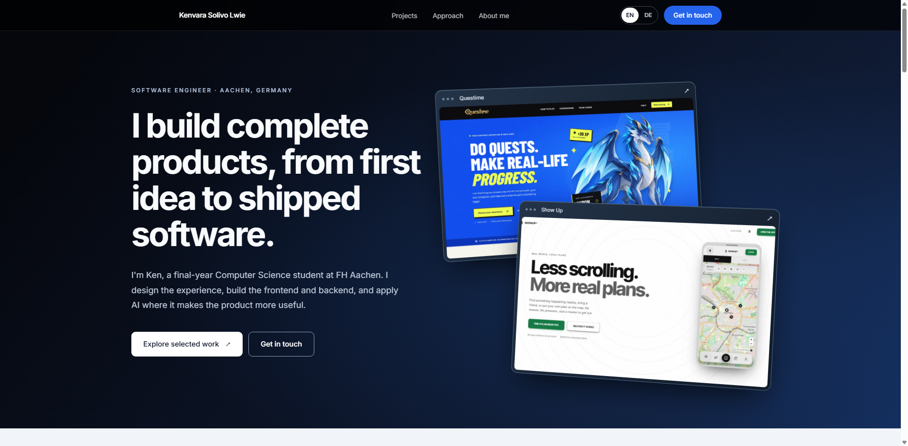

# Kenvara Solivo Lwie - Portfolio



The personal portfolio of Kenvara Solivo Lwie, a Computer Science student and software engineer building full-stack products with Applied AI. The homepage leads with Chattrolley and Show Up, followed by Questime, and each has a focused case study.

---

## 🚀 Features

*   **Responsive Design:** Fully optimized for mobile, tablet, and desktop views.
*   **Bilingual (EN / DE):** In-page language switch powered by a lightweight `data-i18n` system - no reload, no framework.
*   **Project-led homepage:** Selected work follows the hero, with clear paths to contact and three focused case studies.
*   **Responsive interactions:** Keyboard navigation, a mobile menu, restrained scroll reveals, and reduced-motion support.
*   **Fast & SEO-friendly:** Vite-built static output, optimized images (`sharp`), lazy-loaded assets, and Open Graph + meta tags for rich link previews.

---

## 🛠️ Tech Stack

*   **Frontend:** Vanilla JavaScript (ES modules), Tailwind CSS, HTML
*   **Build / Tooling:** Vite, PostCSS, Autoprefixer, `sharp` (image optimization)
*   **Deployment:** GitHub Pages (automated via GitHub Actions)

---

## ⚙️ Local Development

Follow these steps to get a local development server running on your machine.

### Prerequisites

Make sure you have Node.js installed.
```bash
node -v
npm -v
```

### Setup

1.  Clone the repository:
    ```bash
    git clone https://github.com/kenvarasolivo/Portfolio.git
    cd Portfolio
    ```

2.  Install dependencies:
    ```bash
    npm install
    ```

3.  Start the development server (opens at `http://localhost:5173`):
    ```bash
    npm run dev
    ```

### Available Scripts

| Command                   | Description                                            |
| ------------------------- | ------------------------------------------------------ |
| `npm run dev`             | Start the Vite dev server with hot-reload.             |
| `npm run build`           | Build the production site into `dist/`.                |
| `npm run check:content`   | Check translation keys and local links on all five pages. |
| `npm run preview`         | Preview the production build locally.                  |
| `npm run optimize-images` | Optimize images in place via `scripts/optimize-images.mjs`. |

---

## 📁 Project Structure

```
.
├── index.html              # Project-led homepage
├── projects.html           # Full project archive
├── show-up.html            # Show Up case study
├── questime.html           # Questime case study
├── chattrolley.html        # Chattrolley case study
├── src/
│   ├── main.js             # Homepage/archive interactions and language switch
│   ├── case-study.js       # Case-study language switch
│   ├── i18n.js             # EN / DE translation strings
│   └── style.css           # Tailwind layers + custom styles
├── scripts/
│   └── optimize-images.mjs # Image optimization script
├── public/                 # Static assets copied verbatim (images, favicon)
├── tailwind.config.js
├── postcss.config.js
├── vite.config.js
└── .github/workflows/deploy.yml  # CI/CD: build & deploy to GitHub Pages
```

---

## 🚀 Deployment

Deployment is fully automated via GitHub Actions. Every push to `main` triggers
the [`deploy.yml`](.github/workflows/deploy.yml) workflow, which builds the site
with Vite and publishes the `dist/` output to **GitHub Pages** - no manual steps
required. The workflow can also be run on demand from the Actions tab
(`workflow_dispatch`).

---

<p align="center"><i>Web interfaces, full-stack products, and applied AI.</i></p>
